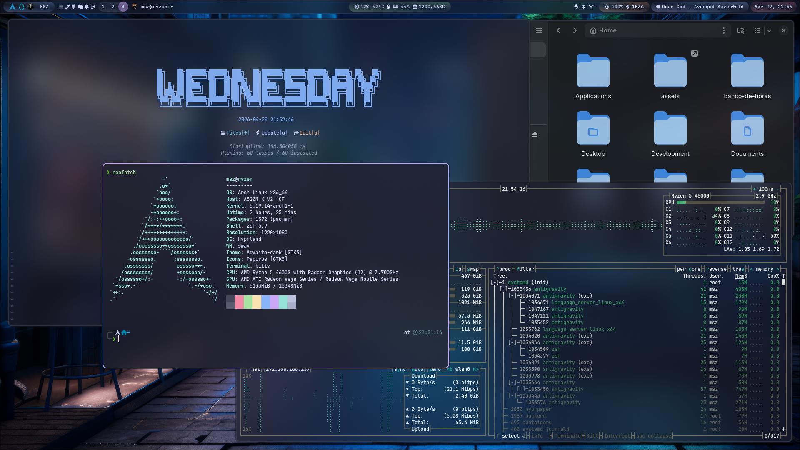
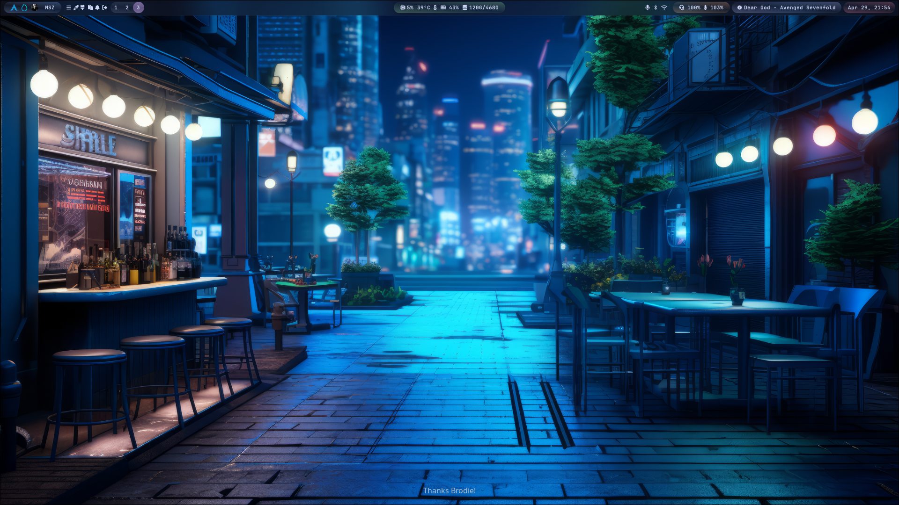

# ❄️ Hyprland Dotfiles

[](https://archlinux.org/)
[](https://hyprland.org/)
[](https://www.zsh.org/)
[](https://opensource.org/licenses/MIT)

A sleek, modern, and highly functional Hyprland configuration for Arch Linux, featuring a consistent aesthetic and a focus on productivity.

---

## 📸 Screenshots




---

## 📑 Table of Contents

- [🚀 Features](#-features)
- [📋 Prerequisites](#-prerequisites)
- [📦 Installation](#-installation)
- [⌨️ Keybindings](#-keybindings)
- [⚙️ Configuration & Customization](#-configuration--customization)
- [📂 Repository Structure](#-repository-structure)
- [🙏 Credits](#-credits)

---

## 🚀 Features

- **Window Manager**: [Hyprland](https://hyprland.org/) (Wayland-based compositor).
- **Status Bar**: [Waybar](https://github.com/Alexays/Waybar) with system stats, workspaces, and media control.
- **Launcher**: [Wofi](https://hg.sr.ht/~scoopta/wofi) for application searching and clipboard history.
- **Terminal**: [Kitty](https://sw.kovidgoyal.net/kitty/) with a customized theme.
- **Notifications**: [SwayNC](https://github.com/ErikReider/SwayNotificationCenter) for a modern notification center.
- **Audio Visualizer**: [Cava](https://github.com/karlstav/cava) integrated into Waybar.
- **Shell**: Zsh with [Oh My Zsh](https://ohmyz.sh/), [Powerlevel10k](https://github.com/romkatv/powerlevel10k), and syntax highlighting.
- **Theme**: Catppuccin Mocha aesthetic across most components.
- **Utilities**: `hyprlock` for locking, `hypridle` for power management, `grim`/`slurp` for screenshots, and `cliphist` for clipboard management.

---

## 📋 Prerequisites

Before installation, ensure you have:

1.  **Arch Linux** installed and updated.
2.  **Pipewire** as your audio server.
3.  **GDM** (recommended) or another display manager.
4.  **Multilib** repository enabled in `/etc/pacman.conf`.
5.  A working **AUR helper** (the script will install `yay` if missing).

---

## 📦 Installation

1.  **Clone the repository**:
    ```bash
    git clone https://github.com/soaresmessiasg130/hyprland-dotfiles.git ~/hyprland-dotfiles
    cd ~/hyprland-dotfiles
    ```

2.  **Install dependencies**:
    ```bash
    ./1-install-dependencies.sh
    ```
    *Note: This script will prompt for your password and may require confirmation for some AUR packages.*

3.  **Setup configuration links**:
    ```bash
    ./2-setup-links.sh
    ```
    *This script will ask if you want to backup your existing configurations before creating symlinks.*

4.  **Reboot your system**:
    ```bash
    ./3-reboot-system.sh
    ```

---

## ⌨️ Keybindings

The default modifier key is `SUPER` (Windows key).

| Shortcut | Action |
| :--- | :--- |
| `SUPER + A` | Open Terminal (Kitty) |
| `SUPER + S` | Open Browser (Chrome) |
| `SUPER + D` | Open File Manager (Nautilus) |
| `SUPER + Z` | Application Launcher (Wofi) |
| `SUPER + Q` | Close Active Window |
| `SUPER + C` | Toggle Fullscreen |
| `SUPER + F` | Toggle Floating Mode |
| `SUPER + V` | Clipboard History |
| `SUPER + W` | Open Notification Center |
| `SUPER + SHIFT + S` | Screenshot to Clipboard |
| `SUPER + CTRL + SHIFT + S` | Screenshot to File |
| `SUPER + 1-0` | Switch Workspaces |
| `SUPER + CTRL + Arrows` | Switch Workspaces |

---

## ⚙️ Configuration & Customization

### Monitors
Edit `hypr/hyprland.conf` to set your monitor resolution and refresh rate.
```bash
# Example: monitor = [NAME], [RES@FPS], [OFFSET], [SCALE]
monitor = HDMI-A-1, 1920x1080@100, 0x0, 1
```

### Waybar CPU Temperature
If your CPU temperature is not showing, you may need to find your thermal sensor path:
1. Find your sensor file: `find /sys/class/hwmon/ -name "temp*_input"`
2. Update the path in `waybar/config.jsonc` under the `"cpu"` or `"temperature"` module.
3. Restart Waybar: `killall waybar && waybar &`

### User Logo
To change the logo shown in Waybar:
- Save your image as `user.png` in the `assets/` directory.
- Reboot or restart Waybar.

---

## 📂 Repository Structure

- `hypr/`: Hyprland main configuration and themes.
- `waybar/`: Status bar configuration and styling.
- `wofi/`: Application launcher styles.
- `kitty/`: Terminal emulator configuration.
- `zsh/`: Zsh configuration files (`.zshrc`, `.p10k.zsh`).
- `assets/`: Wallpapers and UI assets.
- `fonts/`: Custom fonts used in the setup.
- `scripts/`: Various utility scripts for installation and setup.

---

## 🙏 Credits

- [Hyprland](https://hyprland.org/)
- [Catppuccin](https://github.com/catppuccin/catppuccin) for the color palette.
- [Waybar](https://github.com/Alexays/Waybar)
- [SwayNC](https://github.com/ErikReider/SwayNotificationCenter)
- [Powerlevel10k](https://github.com/romkatv/powerlevel10k)
